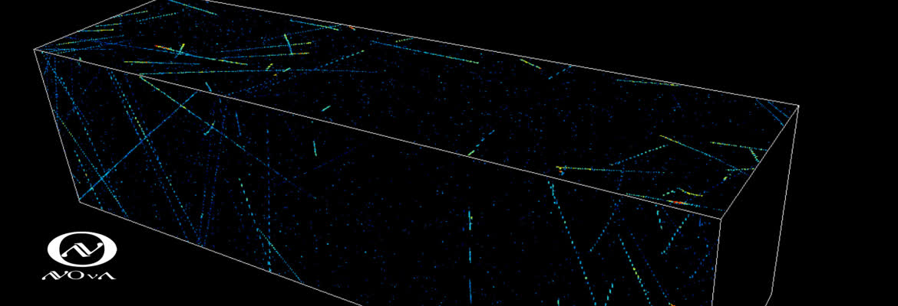

*Banner from the [NOvA experiment website](https://novaexperiment.fnal.gov/how-does-nova-work/) showing superposed data on the detector outline.*
## Overview
The NOvA detector is a novel particle detector for the NOvA experiment.  It's main intended use is for the detection of neutrinos, but particle detectors are considered to be proverbial gold mines for new physics.  Sifting through the data in search of never before seen particles is an ever-present challenge.  The advancement of modern machine learning techniques, in particular in the areas of the unsupervised learning, has a lot to offer this process.  Motivated by these advancements, I applied an Auto-Encoder to explore the possibility of unsupervised feature selection.  The following thesis outlines the work and results from this culminating project, completed with the help of my thesis advisor, Dr. Norm Buchanan.

<iframe src="../assets/pdf/bachelors_thesis.pdf" width="100%" height="600px"></iframe>

## Project Contributions

Initial concept of the work was formulated by my advisor, Dr. Norm Buchanan, but the exploration of state-of-the-art methods and implementation were handled solely by myself.         

## Code and Tech
* **Jupyter Notebook**: available on [**GitHub**](https://github.com/buzzwalter/NOvA_feature_selector.git).
* **Tech**: Auto-Encoder, Python, PyTorch, SciPy Stack  

## Duration
Approximately half a year under the requirements of the CSU Honors Program alongside coursework and other projects in the final year of my undergraduate studies.