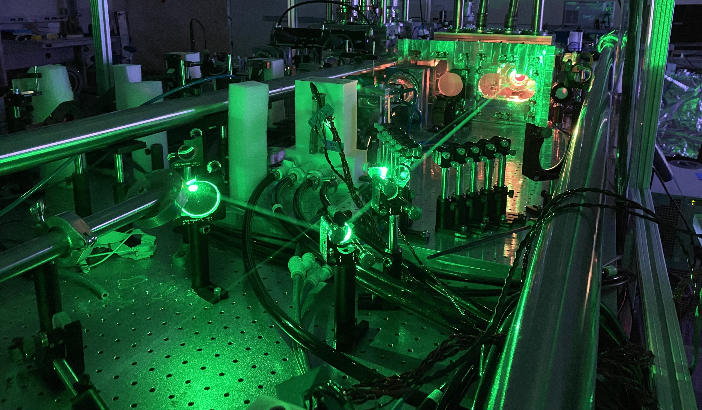

## Overview 
In the fascinating world of pulsed lasers, generating a powerful, stable beam is a bit like conducting an orchestra: every element must be in perfect harmony. However, when using crystals as a gain medium to amplify laser light, thermal effects — akin to subtle, unwanted fluctuations in temperature — can disrupt this harmony. One of the main ways the thermal effects decrease the output is they change the alignment of the laser through thermal lensing, a process where the pressure imposed by temperature differences between areas of the crystal adjust the curvature of the surfaces that the laser light is incident on. The alignment matters because for many gain media, including crystal gain media, there is an overlap between a pump laser, the energy source which can be viewed as a river, and the seed laser which can viewed as a generator that runs off with the useful energy.  One can have stability issues with either beam, but typically it is the seed laser which has an issue because it passes through the gain media often multiple times to extract the most energy.   Specifically, with a cryogenically cooled system, the back of the crystal is nearly 77 K, the temperature of liquid nitrogen, whereas the front can heat up to several tens of degrees above this value.  The lensing takes time to occur, so if you turned the laser on you could maintain a stable amplified output for a minimal amount of time.  However, this defeats the purpose of building a laser for applications since most applications of lasers involve keeping them on for longer time periods. A control system like this is critical because if it is necessary, it takes a system which is effectively unstable to indefinitely stable.

One solution to this problem is to introduce active feedback.  Active feedback involves measuring some signal in your system, processing it, and putting external energy into correcting it.  In this case it took the form of [piezo actuators](https://www.thorlabs.com/thorproduct.cfm?partnumber=PIAK10) connected to a [controller](https://www.thorlabs.com/thorproduct.cfm?partnumber=KIM101), and a [camera](https://www.baslerweb.com/en/shop/aca1920-155um/), although admitedly cheaper options could've been used, these were on hand.  In principle, alignment in optics takes four adjustment axes, two for adjusting where the beam is located in the plane of interest, and two for adjusting the angle of approach of the beam.  These axes take the form of the standard adjustment screws that one can find on mirror mounts, so by attaching the piezo actuators to two well placed mirror mounts and controlling their adjustment using analyzed feedback from the camera, one can maintain the stability of the laser.  The form of the feedback is just a beam profile, but with the two different mirrors being assigned different tasks, one for spatial alignment, and one for angular alignment, it's necessary to extract multiple inputs.  For this, the exterior portion of the beam was chosen for the angular input based on the nature of beam propagation and the Fourier pair nature of ray trajectory and spatial location at the input image. For the input of the spatial adjustment, the interior of the beam was chosen. In both cases, the average of the distribution in the horizontal and vertical axes were chosen since these are directly connected to one of the piezo actuators for each mirror.

## Project Contributions

Positioned the mirror mounts, motor controller, and camera as well as wrote the Matlab code for frame to frame data processing dictating motor control.  Tested to fine-tune control parameters and orient axes.  Introduced triggering and simultaneous diagnostic data of the pointing and integrated energy intensity in version 2.0.     

## Code and Tech
* **Tech**: PID, Active Control, MIMO, Matlab, Cameras, Time-to-digital Converters

## Duration
An initial fully functional version was operational before the summer, but the final sophisticated version wasn't finished until half way through the summer.
