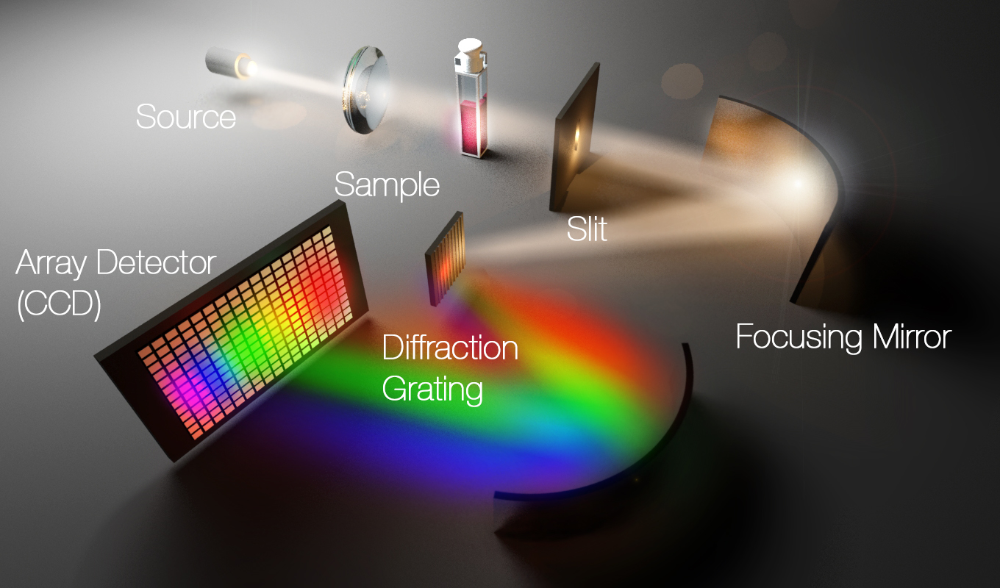

*([Optecks](https://www.optecks.com/Portal/index.php/knowledge-center/spectroscopy-root/spect1))*
## Overview 
Diagnostics are very important for a variety of reasons in experimental physics.  In fact, most of experimental physics can just be though of as trying to characterize uncertainty or bias in the systems that you're using to glean information about how the world works.  For any laser which is meant to sold or used in applications, it is critical to know this value, and it in principle can also estimate how well the lasers can be used for interference based applications, i.e. it can estimate its coherence length. and it can also inform designs for compressing the laser pulse which is pivotal for high peak power applications like lithography, the subject associated with development of the state-of-the-art chips in our cellphones.     

## Project Contributions
I oversaw the Solidworks design and managed the physical construction of all the parts.  I also wrote the control software in Qt creator using C++ and Mightex SDK.  Additionaly I performed the testing and developed the optical fiber housing critical to eliminating auxiliary signals.  

## Code

## Tech
C++, Qt, Solidworks, Zeemax, Optics, Yb:YAG, Gratings, and CNCs

## Duration
About two weeks of my time.  An REU intern assisted in the process.   
