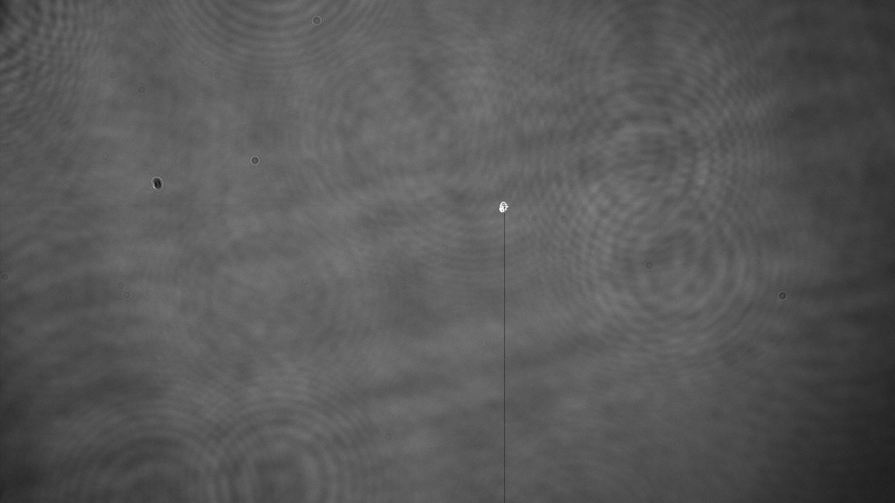

*Beam profile captured by a damaged camera showing diffraction patterns from a variety of sources in the beamline.*
## Overview 
At the heart of any laser system lies its most crucial and often most expensive component: the gain medium. This component, typically a crystal like Yttrium-Aluminum-Garnet (YAG) or Titanium-Sapphire, is where the magic of amplification happens. However, it's also where vulnerabilities lie. Damage to these crystals isn't about them breaking in the traditional sense but rather getting damaged by the laser's own light—be it from too concentrated a beam, excessive energy, or even a tiny speck of dust at the wrong place and time. Such damage not only harms the crystal but can cascade, wreaking havoc on the entire system.

Given the millisecond timescales on which these lasers operate, especially pulsed lasers, human reaction times are far too slow to prevent damage in the event of a problem. This is where our project steps in, leveraging cutting-edge camera and electronics technology to monitor each laser shot in near-real-time. By analyzing shots faster than a millisecond, we aim to extend the life of these critical components and safeguard the surrounding optics.    

## Project Contributions
My role was pivotal in developing the algorithms that sit at the heart of our vision interlock system, mostly through C++ coding. I also crafted the test environments from scratch, employing a beam splitter, wave plate, mirrors, and a translatable stage for intricate setups. The triggering and timing, critical for data collection and testing, were areas I led, enabling our system to detect and predict damage before it became catastrophic.

Initially, we anticipated complex solutions would be needed. However, through extensive testing and data collection, we discovered the algorithms required to predict damage could be surprisingly simple—a revelation that could only have been reached with thorough experimentation.

## Code and Tech
* **Tech**: Yb:YAG/TiSa Lasers, Matlab, Vacuum Systems, Digital Delay Generators, Qt, C++, Zeemax, and Cryogenics

## Duration
Over 2-3 months, I managed an REU intern, guiding them through the process and contributing significantly to our progress.
