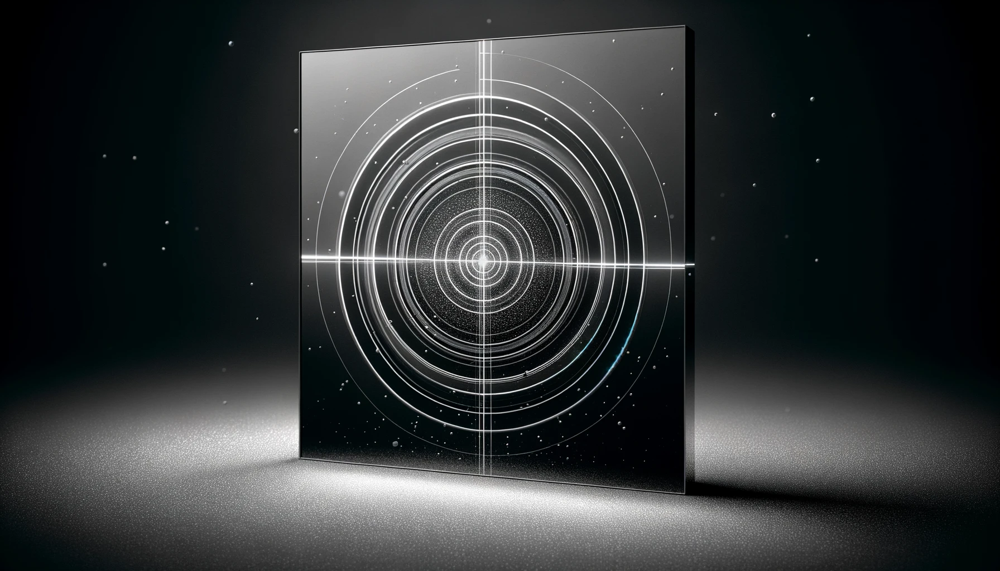

## Overview 
 In any laser system typically the most important and expensive part is the gain medium, which is typically a crystal in the case of doped Yittrium-Aluminum-Granat (YAG) laser or Titanium-Sapphire lasers.  These crystal don't break in the normal sense, but rather they get damaged by the laser itself since the amplification process is a result of a laser passing through the crystal. If the beam is too small on the crystal or the energy becomes too great, or even if a spec of dust or dirt happens to land in the wrong place at the wrong time, the coating on the crystal can start to burn and cascading damage will occur throughout the system.  Also, depending on the application of the laser (if it is a pulsed laser), the time between shots can be on the order of milliseconds which means this cascading effect becomes so accelerated that human reaction times involved with shutting off the laser become a serious problem.  Current technology in cameras and electronics allow us to monitor the beam shot-to-shot, so as long as the computational time used in determining whether damage is starting to occur is slightly under a millisecond, the crystal can potentially live a longer life as well as the optics down and upstream from the beam line.       

## Project Contributions
I contributed to the C++ code mostly in algorithm development as well as built all the test environments using a beam splitter and wave plate with mirrors and a translatable stage.  The time-to-digital setup and triggering were also an important part of the project that I had to led in order for the system to even measure and collect data for testing, otherwise we wouldn't have been able to gain traction in developing the algorithm.  It actually turned out the first order damage prediction algorithms were much simpler than we thought, but we wouldn't have been able to find this fact without testing and gathering lots of data.     

## Code

## Tech
Yb:YAG/TiSa lasers, Matlab, vacuum systems, digital delay generators, Qt, C++, Zeemax, and cryogenics

## Duration
About 2-3 months managing an REU intern who helped in the process.
