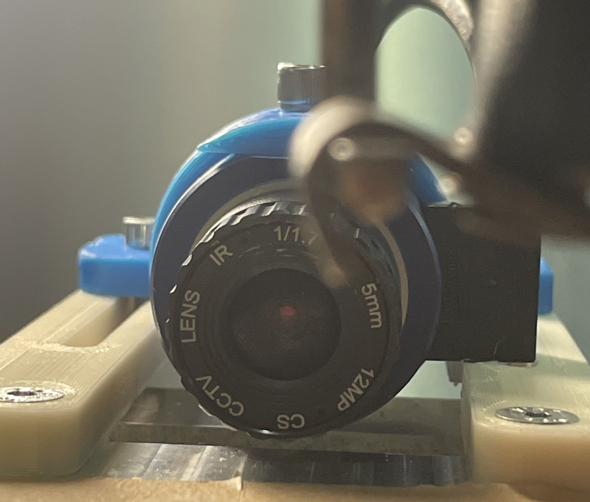

*Basler puA 1280 - 54ucMIC camera and custom made mount used for data capture in the project.*
## Overview          
Various forms of 3D printing have been around for decades, garnering considerable interest from both hobbyists and manufacturers. However, additive manufacturing methods are primarily used for prototyping and time-sensitive niche solutions with low volume. Adapting such methods for large-scale use requires proving scalability in manufacturing processes can be achieved. Process monitoring, as a means to reduce yield loss and increase product quality, is paramount to this goal.

The main objectives of this project were twofold, with the second building on the first. The first goal was to establish a basic process monitoring algorithm to predict print status using sensor feedback. The second goal was to extend some or all of the functionality of the basic process monitoring algorithm to quantify print characteristics, such as over-extrusion and under-extrusion, and stabilize them to desirable values.

## Project Contributions
At the time of this work, the company was gearing up for a big production push, so it was pretty much done solo with the exception of some help in Fusion with designing parts.  That being said, many a fruitful discussion were had with colleagues about the overall direction and feasibility about certain approaches -- some old-fashioned "rubber ducking" if you will.  

## Code
 * **Tech**: Python, C++, Cameras, React, FastAPI, Docker, WebSocket communication, Fusion, 3D printers

## Duration
3 months total.